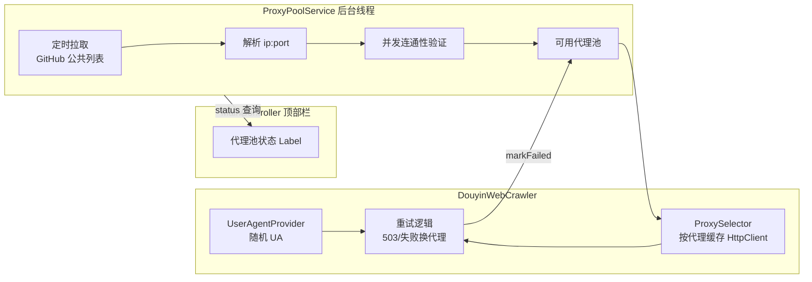

## 产品概述

针对抖音爬取频繁返回 HTTP 503（反爬拦截/限流）的问题，增强爬取器的伪装与反封能力：

1. **动态伪装 User-Agent**：每次请求从内置/自定义的浏览器 UA 池中随机选取，避免固定 UA 被识别。
2. **免费代理池**：定时从 GitHub 公共代理列表（一行一个 `ip:port` 的 raw 文本）拉取代理，并发连通性验证后保留可用代理；每次请求随机轮换一个代理，503 或连接失败时自动剔除并换代理重试；代理池为空时直连兜底，保证监控不中断。
3. **界面状态展示**：在顶部工具栏显示代理池状态（可用代理数量、最近刷新时间），随现有 5 秒刷新定时器更新。

## 核心特性

- 多浏览器 UA 随机轮换（内置 Chrome/Edge/Firefox 等常用版本，支持配置自定义追加）
- 代理池：多数据源拉取（默认内置 2-3 个 GitHub raw 列表，支持逗号分隔自定义源）→ 并发验证 → 随机轮换使用 → 失败剔除 → 定时刷新
- 重试策略：503/连接异常换代理重试（默认最多 3 次），全部失败或池为空时直连
- 配置化：代理开关、数据源、刷新间隔、验证超时、池上限、重试次数、自定义 UA 均可通过 db.properties 配置
- 代理池状态实时显示：可用数量 + 最近刷新时间

## 边界约束

- 免费代理质量差属预期，代理池拉取/验证/使用全程失败时程序必须正常运行（直连兜底）
- 不改变 `DouyinCrawler` 接口与 `MonitorScheduler` 调用方式
- 代理池拉取/验证/刷新在独立后台线程执行，不阻塞爬取线程

## 技术栈

- Java 25 + JDK 内置 `java.net.http.HttpClient`（无需新增第三方依赖）
- Java 并发：`ScheduledExecutorService`（定时拉取/刷新）、固定线程池（并发验证）、`ConcurrentHashMap`/`CopyOnWriteArrayList`（代理池存储）
- 配置读取：复用现有 `ConfigUtil`（从 classpath `config/db.properties` 读取，新增 `getBoolean` 方法）
- 日志：SLF4J + Logback（复用现有 logger，不打业务库日志）

## 实现方案

### 架构设计

新增两个核心组件，均位于 `crawler` 包：



### 关键设计决策

1. **UserAgentProvider**：内置约 12-15 个主流浏览器 UA（Chrome/Edge/Firefox，含 Windows/macOS/Android 平台），支持 `crawler.user.agents` 配置追加自定义 UA；`random()` 线程安全随机选取。
2. **ProxyPoolService**（代理池核心）：

- `start()` 启动后台 `ScheduledExecutorService`，按 `crawler.proxy.refresh.minutes`（默认 30 分钟）周期拉取；首次拉取在独立线程立即执行。
- 拉取：直连 HttpClient GET 各 raw 源 URL（配置 `crawler.proxy.sources`，逗号分隔，内置默认 monosans/proxy-list、TheSpeedX/PROXY-List、proxifly/free-proxy-list 的 HTTP 列表），逐行解析 `ip:port`。
- 验证：固定线程池（默认并发 20，可配置）对候选代理发 HTTPS CONNECT 到轻量验证目标（默认 `https://www.gstatic.com/generate_204`，超时 8 秒可配置），通过者进入可用池；`crawler.proxy.max.count`（默认 50）限制池上限。
- 使用：`next()` 从可用池随机返回一个代理；`markFailed(proxy)` 将失败代理移出可用池（下次刷新重新验证拉回），避免反复使用坏代理。
- 状态：`getStatus()` 返回可用数量、最近刷新时间，供 UI 轮询。
- 存储：`CopyOnWriteArrayList<Proxy>` + `AtomicReference` 记录刷新时间；`Map<Proxy,HttpClient>` 按代理缓存 HttpClient 复用连接（数量受池上限约束，内存可控）。
- 线程安全：所有方法对并发访问安全；`shutdown()` 关闭所有线程池。

3. **DouyinWebCrawler 改造**：

- 构造函数重载：默认构造内部自建并启动 ProxyPoolService（保持兼容）；注入构造接收外部实例（MainController 传入共享实例以管理生命周期与 UI 状态查询）。
- `fetch(url)` 重写为带重试：每次尝试随机 UA 构建 HttpRequest，从池中取一个代理（池空则直连 HttpClient 兜底），`client.send()`；状态码 503 或 IOException 时 `markFailed` 当前代理并重试（默认最多 3 次，`crawler.retry.count` 可配）；最终失败按现有模式 `log.warn` 并返回 null。
- 按代理缓存 HttpClient（`ConcurrentHashMap<Proxy,HttpClient>`），代理被剔除时移除缓存条目；直连 client 单独缓存单例。
- 新增 `shutdown()` 关闭内部代理池（若为自建）。

4. **MainController 集成**：

- 构造时创建共享 `ProxyPoolService` 并 `start()`，注入 `DouyinWebCrawler`；`shutdown()` 时停止代理池。
- 顶部栏（`buildTopBar()`）新增 `Label lblProxyStatus`，初始"代理池：初始化中…"；在现有 `startRefreshTimer()` 5 秒回调中更新为"代理池：可用 N · 刷新 HH:mm:ss"，代理池不可用时显示"代理池：不可用（直连）"。

### 性能与可靠性

- 验证并发受限（默认 20）+ 短超时（8s），避免验证风暴；拉取/验证/刷新全部在独立后台线程，不阻塞 30 秒爬取周期。
- 重试上限 3 次，流量放大可控（30s 间隔 × 主播数 × 3）。
- 免费代理源可能失效/质量差：拉取失败、验证全失败、使用中全失败均静默降级为直连，保证监控功能不中断（沿用现有"失败不中断"模式）。
- 代理来自外部不可信数据，仅用于 HTTP 转发，不做任何特权操作；日志只记录代理 ip:port 与数量，不记录敏感内容。

### 目录结构

```
src/main/java/com/kaibotixing/
├── crawler/
│   ├── UserAgentProvider.java   # [NEW] UA 池：内置浏览器 UA 列表 + 配置追加，random() 随机选取
│   ├── ProxyPoolService.java    # [NEW] 代理池核心：定时拉取、解析、并发验证、随机轮换、失败剔除、状态查询、shutdown
│   └── DouyinWebCrawler.java    # [MODIFY] 集成随机 UA + 代理请求 + 503/失败换代理重试 + 直连兜底 + shutdown
├── util/
│   └── ConfigUtil.java          # [MODIFY] 新增 getBoolean(key, default) 方法（"true"/"1" 为 true）
└── ui/
    └── MainController.java      # [MODIFY] 创建并管理 ProxyPoolService 生命周期；顶部栏新增代理池状态 Label；5 秒定时刷新状态
src/main/resources/config/
    └── db.properties            # [MODIFY] 新增 crawler.proxy.enabled/sources/refresh.minutes/validate.timeout.seconds/max.count、crawler.retry.count、crawler.user.agents 配置项
README.md                        # [MODIFY] 补充代理池与 UA 轮换的配置说明
```

### 新增配置项（db.properties）

```
crawler.proxy.enabled=true
crawler.proxy.sources=https://raw.githubusercontent.com/monosans/proxy-list/main/proxies/http.txt,https://raw.githubusercontent.com/TheSpeedX/PROXY-List/master/http.txt,https://raw.githubusercontent.com/proxifly/free-proxy-list/main/proxies/protocols/http/data.txt
crawler.proxy.refresh.minutes=30
crawler.proxy.validate.timeout.seconds=8
crawler.proxy.max.count=50
crawler.retry.count=3
crawler.user.agents=
```

代码中全部带默认值兜底（ConfigUtil.get/getInt/getBoolean 缺键时返回默认值），保证配置文件缺项时程序仍可运行。

## Agent Extensions

### Skill

- **Java编程专家**
- 用途：指导编写 ProxyPoolService（并发拉取/验证/轮换/剔除）、UserAgentProvider 与 DouyinWebCrawler 重试逻辑等 Java 并发与网络代码，确保线程安全与异常处理符合项目既有模式
- 预期结果：代理池与爬取器改造代码质量可靠，线程安全、异常处理完善，与现有 Java 25 + HttpClient 架构一致