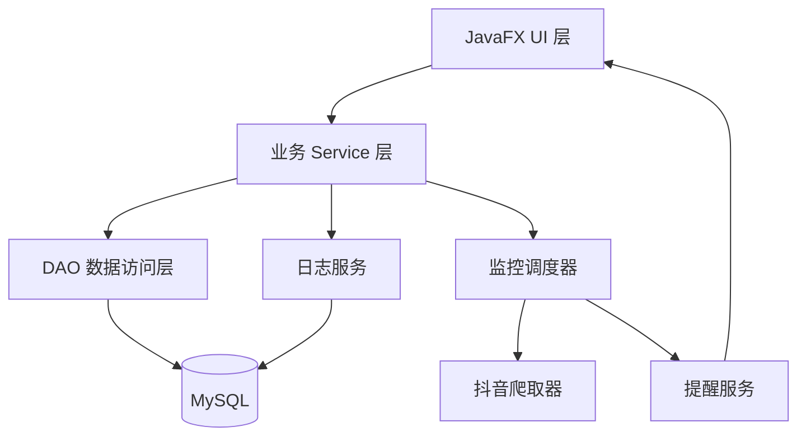

## 产品概述

一款基于 JavaFX 的 Windows 桌面应用，用于监控多个抖音主播的开播状态。软件通过多线程每 30 秒并发爬取主播直播状态，数据与配置全部持久化到 MySQL，提供图形化界面用于主播管理、实时状态展示、日志查看与监控启停控制，并在检测到主播开播时进行弹窗与声音提醒。

## 核心功能

- 主播管理：对主播进行增、删、改、查，字段含昵称、抖音号/主页 URL、房间号(web_rid)、备注、是否启用监控。
- 定时监控：每 30 秒（可配置）通过线程池并发爬取多个主播的直播状态，解析抖音页面中的 roomId/live 状态标志。
- 监控状态展示：界面实时刷新显示各主播当前开播状态（开播/未开播/未知异常）。
- 监控启停控制：一键启动/停止监控调度，启停状态持久化到数据库，重启后恢复。
- 日志查看：监控过程与爬取结果记录到数据库与界面，便于排查。
- 开播提醒：检测到主播由未开播变为开播时，弹出通知窗口并播放提示音。
- 数据持久化：主播列表、监控配置、爬取结果、日志全部存入 MySQL。
- 打包发布：使用 jpackage 将应用打包为 Windows 可执行文件(exe)。

## 技术栈选型

- 语言与运行环境：Java 25（OpenJDK 25.0.3 LTS）
- GUI：JavaFX 23.0.x（org.openjfx:javafx-controls / javafx-fxml），配合 FXML + CSS
- 数据库：MySQL（阿里云 RDS），驱动 com.mysql:mysql-connector-j，连接池 HikariCP
- 持久化：纯 JDBC + DAO 层（项目规模不大，避免引入重框架，保持轻量与可控）
- 爬取：java.net.http.HttpClient（同步/异步），JSON 解析 Jackson，HTML 用正则/字符串解析内嵌 JSON
- 日志：slf4j + logback（文件日志），同时自建业务日志表写入数据库
- 多线程：ScheduledExecutorService（定时调度）+ 线程池（ExecutorService）并发爬取
- 构建：Maven，maven-shade-plugin 打 fat jar，jpackage + jlink 打包 exe
- 测试：JUnit 5

## 实现方案

### 总体策略

从零搭建标准分层架构（表现层 JavaFX / 业务层 Service / 数据层 DAO / 集成层爬取与调度）。核心思路：调度器每 30 秒触发一轮任务，将启用中的主播拆分为并发爬取任务，解析抖音页面得到「是否开播」，比对上一轮状态以检测「开播边沿」，触发提醒，并将结果与日志持久化。GUI 通过 JavaFX 的 Platform.runLater 安全刷新 UI。

### 关键设计决策

1. JavaFX 启动器分离：由于 JavaFX 模块化限制，创建不继承 Application 的 Launcher 类作为 main 入口，内部调用 Application.launch，避免运行时报「缺少 JavaFX 运行时组件」。
2. 多线程模型：一个 ScheduledExecutorService 负责定时调度（固定 30 秒，可配置），每轮对启用中的主播用线程池（大小可配置，默认 5）并发爬取，使用 CountDownLatch 或 Future 汇总。状态变更检测与提醒在结果汇总阶段处理，避免 UI 线程阻塞。
3. 爬取容错：抖音反爬强、页面易变，爬取失败或解析失败统一记为「未知/异常」状态并记录日志，不中断整轮监控；解析逻辑封装为独立可替换的 DouyinCrawler 接口实现，便于后续切换数据源。
4. 状态持久化：主播表存「最新状态」，每次爬取后 UPSERT；monitor_record 存历史每次爬取结果；开播边沿事件记录后触发提醒。
5. 敏感信息：数据库连接信息放 resources/config/db.properties，并加入 .gitignore，避免硬编码。

### 性能与可靠性

- 爬取为 IO 密集，采用并发线程池，N 个主播一轮耗时为 max(单次请求耗时)，而非累加；单次 HTTP 超时设为 10 秒，避免线程被拖死。
- 数据库连接池复用连接，避免每轮新建连接的开销。
- UI 刷新通过 Platform.runLater 批量更新，避免频繁 UI 更新导致卡顿；日志视图采用滚动追加+行数上限。
- 边界情况：主播被删除时停止其爬取任务；监控停止时优雅关闭线程池；应用退出时释放连接池与调度器。

## 实现细节（执行要点）

- pom.xml 需显式声明 JavaFX 平台分类器（win），并配置 javafx-maven-plugin 的 mainClass 指向 Launcher。
- maven-shade-plugin 需排除签名文件，配置 transformer 处理 JavaFX 与日志的资源合并。
- jpackage 依赖 jlink 生成的自定义运行时镜像，使用 jdeps 分析依赖模块。
- 抖音解析：请求 https://live.douyin.com/{web_rid}，从返回 HTML 中提取 window.**INIT_PROPS** 或 RENDER_DATA 内嵌 JSON，读取 room 的 status（2=直播中，4=未开播等）；需携带合理 User-Agent 与 Referer；无 web_rid 时先请求用户主页解析 sec_uid/roomId。
- 数据库建表在首次启动自动执行（schema.sql），幂等（CREATE TABLE IF NOT EXISTS）。

## 架构设计

### 系统架构（分层）



### 模块划分

- ui：Launcher、MainApplication、各 Controller、FXML、CSS
- service：AnchorService、MonitorService、LogService、AlertService
- dao：AnchorDao、MonitorConfigDao、MonitorRecordDao、MonitorLogDao、DataSourceManager
- crawler：DouyinCrawler 接口 + DouyinWebCrawler 实现
- model：Anchor、MonitorConfig、MonitorRecord、MonitorLog、LiveStatus 枚举
- scheduler：MonitorScheduler（定时+线程池+状态变更检测）

### 数据流

定时触发 → 读取启用主播列表 → 线程池并发爬取 → 解析状态 → 汇总比对上一状态 → 检测开播边沿 → 持久化结果/日志 → 触发提醒 → Platform.runLater 刷新 UI

## 目录结构

```
d:/aa_JavaSpaces/KaiBoTiXing/
├── pom.xml                                     # [MODIFY] 补全 JavaFX/MySQL/HikariCP/Jackson/slf4j/logback/JUnit 依赖及 shade/javafx/jpackage 插件
├── .gitignore                                  # [NEW] 排除 target、config 敏感配置、日志
├── src/main/resources/
│   ├── config/db.properties                    # [NEW] 数据库连接信息与监控参数
│   ├── config/schema.sql                       # [NEW] 建表 SQL（anchor、monitor_config、monitor_record、monitor_log）
│   ├── logback.xml                             # [NEW] 文件日志配置
│   ├── fxml/main.fxml                          # [NEW] 主界面 FXML（TabPane：主播管理/监控状态/日志）
│   ├── css/app.css                             # [NEW] 界面样式
│   └── sound/notify.wav                        # [NEW] 开播提示音资源
└── src/main/java/com/kaibotixing/
    ├── Launcher.java                           # [NEW] main 入口，调用 Application.launch
    ├── MainApplication.java                    # [NEW] JavaFX Application，加载主界面
    ├── model/                                  # [NEW] Anchor、MonitorConfig、MonitorRecord、MonitorLog、LiveStatus
    ├── dao/                                    # [NEW] DataSourceManager + 各 DAO 实现
    ├── service/                                # [NEW] AnchorService、MonitorService、LogService、AlertService
    ├── crawler/                                # [NEW] DouyinCrawler 接口 + DouyinWebCrawler 实现
    ├── scheduler/                              # [NEW] MonitorScheduler（定时调度、并发爬取、边沿检测）
    ├── util/                                   # [NEW] 配置读取、JSON 解析、时间格式化等工具类
    └── ui/                                     # [NEW] 各 Tab 的 Controller
```

## 推荐的 Agent 扩展

### Skill

- **Java编程专家**
- 用途：在实现阶段编写与审查 Java 源码，覆盖 JavaFX 界面、多线程调度、JDBC/DAO 层、抖音爬取解析、打包配置等；提供 Java 并发、JDBC、Maven 构建、JVM 与异常排查方面的专业指导。
- 预期结果：产出结构清晰、线程安全、可运行且通过测试的 Java 代码与正确的 Maven/jpackage 打包配置。

### SubAgent

- **code-explorer**
- 用途：在项目从零搭建完成后，用于跨文件探索验证代码结构与依赖引用是否完整、一致，辅助定位遗漏的类、方法签名或配置接线问题。
- 预期结果：确认各模块间引用正确、无缺失符号，为运行测试与打包提供可靠的代码走查结论。